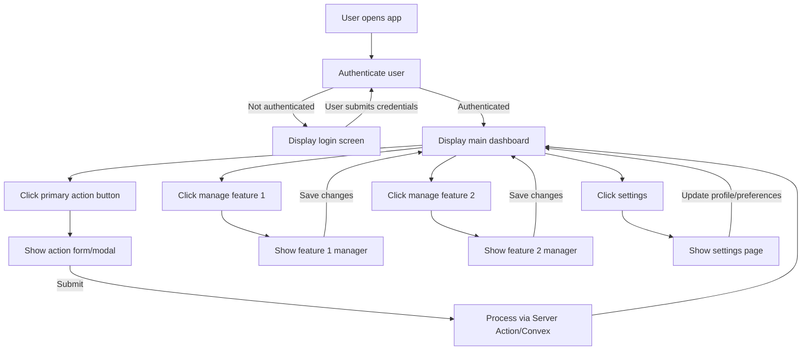

# App Flowchart

> **Purpose:** Visual representation of user flow through the application using Mermaid syntax.

---

## Template Instructions

1. **Customize the flowchart** to match your application's actual user flow
2. **Add more nodes** for additional features and decision points
3. **Use descriptive labels** that match your app's terminology
4. **Include error paths** if they're critical to understanding the flow

### Example Customization

Replace generic labels like:
- `PrimaryAction` → `Add Bookmark`, `Create Post`, `Upload File`
- `ManageFeature1` → `Manage Collections`, `View Analytics`, `Edit Profile`
- `Dashboard` → specific route name if different

### Mermaid Syntax Quick Reference

- `-->` : arrow with no label
- `-->|Label|` : arrow with label
- `[Text]` : rectangular node
- `{Text}` : diamond decision node
- `((Text))` : circle node

For more complex flows, see [Mermaid Flowchart Docs](https://mermaid.js.org/syntax/flowchart.html)

---

**Note:** This flowchart should be kept in sync with the detailed `app_flow.md` document. Update both when making significant changes to user flows.
